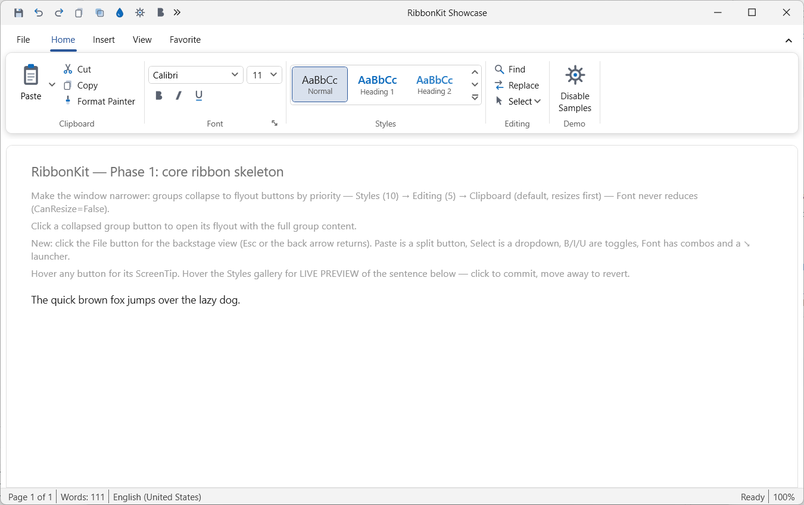
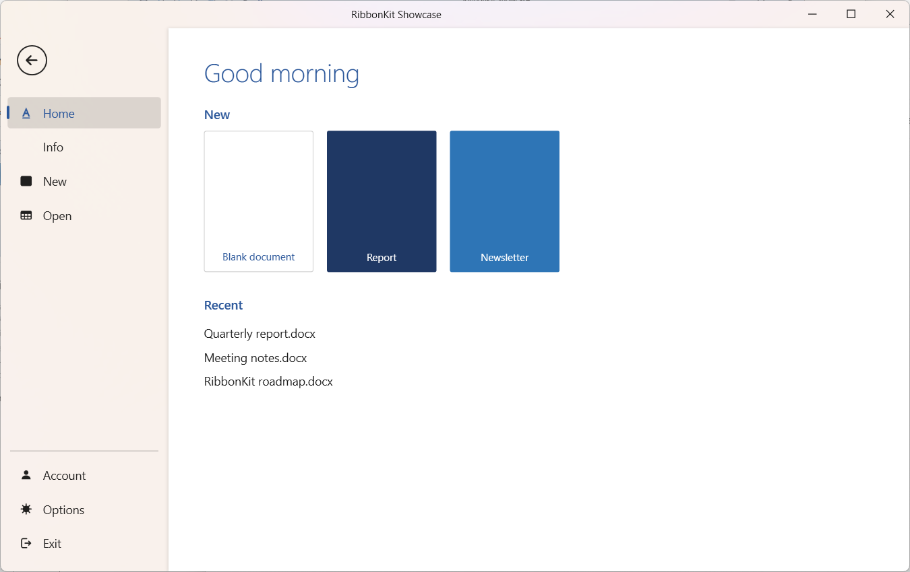
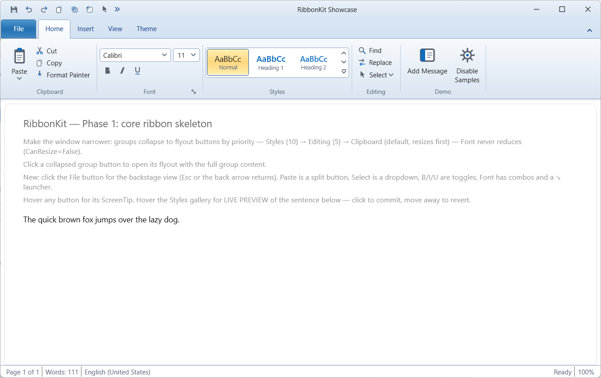
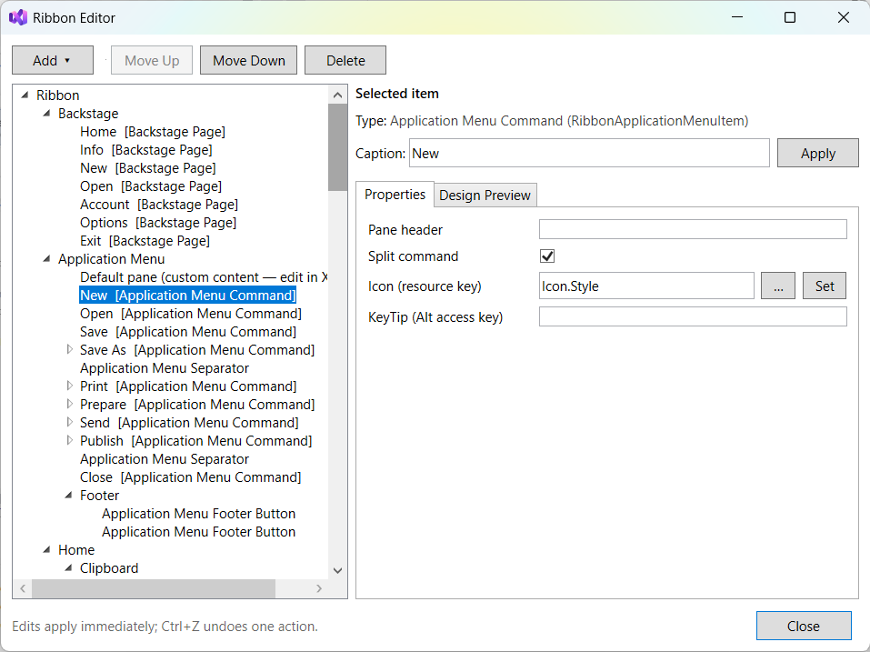

# RibbonKit

An open-source, Office Fluent UI–style **Ribbon control library for WPF** on modern .NET (`net8.0-windows` / `net9.0-windows`).

[](LICENSE)
[](https://dotnet.microsoft.com/)
[](https://www.nuget.org/)

> **Status: alpha (`0.1.0-alpha.1`).** The control set is feature-complete for most real applications — ribbon, backstage, galleries, QAT with overflow, contextual tabs, KeyTips, tab merging, modal tabs, a runtime customization dialog with persistence, five Office themes, and a full design-time experience in Visual Studio. Roadmap phases 1–7 are done, the v1 public API is frozen, and the repository documentation is ready; package/release polish, final validation, and launch remain. See the [roadmap](docs/03-ROADMAP.md).

[Getting started](#getting-started) · [Feature status](#feature-status) · [Theming](#theming--rendering) · [Design tools](#developer-experience) · [Documentation](#documentation) · [Roadmap](#roadmap-to-v10)



*The showcase app in the default Office 2024 theme — adaptive group sizing, an in-ribbon Styles gallery with live preview, a split button, and the quick access toolbar in the title bar with its overflow flyout.*

## Why RibbonKit

WPF's built-in `System.Windows.Controls.Ribbon` is visually stuck around Office 2010 and effectively unmaintained. RibbonKit targets modern .NET only, ships **five Office generations from one shared template set**, and is MVVM-first from day one — `ItemsSource` and `DataTemplate` everywhere, dependency properties, routed events, `ICommand`.

Everything renders from vector geometries rather than control bitmaps, so it remains crisp across
per-monitor DPI changes when the host application enables `PerMonitorV2` awareness.

## Feature status

Legend: ✅ done · 🚧 in progress · 📋 planned

### Structure & layout

| Feature | Status |
|---|---|
| Ribbon root, tab strip, tabs, groups | ✅ |
| Adaptive sizing engine (large → medium → small → collapsed) | ✅ |
| Group collapse-to-popup + dialog launcher (↘) | ✅ |
| Minimize mode (double-click tab / chevron / Ctrl+F1) | ✅ |
| Horizontal scroll for tab strip + groups row (chevrons + wheel) | ✅ |
| `RibbonWindow` — QAT and contextual headers in the title bar | ✅ |
| Simplified single-row ribbon | 📋 post-v1 |

### Controls

| Feature | Status |
|---|---|
| `RibbonButton` — large / medium / small | ✅ |
| Toggle, split and drop-down buttons | ✅ |
| `RibbonMenu` / `RibbonMenuItem` with icons and split items | ✅ |
| `RibbonComboBox` (editable + read-only) | ✅ |
| Control groups / button stacks | ✅ |
| Rich ScreenTips (title, body, image, F1 hint) | ✅ |
| `InRibbonGallery` + expandable, resizable popup | ✅ |
| Galleries inside drop-down menus (color / style pickers) | ✅ |
| Live-preview event contract | ✅ |
| `RibbonCheckBox` / `RibbonRadioButton` | ✅ |
| `RibbonTextBox` (editable + read-only) | ✅ |
| Arbitrary application controls/panels inside `RibbonGroup` (`IRibbonSizeAware` opt-in for adaptive sizing) | ✅ |

### Application-level

| Feature | Status |
|---|---|
| Application button (rectangular tab, or the Office 2007 orb) | ✅ |
| Application menu (2007-style two-pane dropdown) | ✅ |
| Backstage view (Modern 2024, Classic 2013, Classic 2010 designs) | ✅ |
| Backstage footer items, button items, recent-items pattern | ✅ |
| Repeatable `RibbonMessageBar` notifications with animated appearance, action, and dismissal | ✅ |
| Quick Access Toolbar — 3 placements, overflow flyout, right-click add/remove for button, toggle, split and drop-down commands | ✅ |
| Contextual tabs with colored tab groups | ✅ |
| "Customize the Ribbon" + QAT customization dialog (Word-Options style) | ✅ |
| Customization persistence — JSON serialize / restore / reset | ✅ |
| Import / export customization to a file | ✅ |
| Tab merging — `RibbonMergeSource`, whole tabs + groups into host tabs | ✅ |
| Modal tabs (Print-Preview style) | ✅ |



*The backstage over a Windows 11 Mica backdrop. The material shows through because the content behind is HIDDEN rather than blurred — the DWM only composites Mica through pixels the window never painted.*

### Input & accessibility

| Feature | Status |
|---|---|
| KeyTips — full chained Alt navigation (Alt → H → F → S) | ✅ |
| Arrow / Tab / F6 keyboard navigation | ✅ |
| UI Automation peers | ✅ |
| RTL support | ✅ Ribbon, popups/context menus, QAT customization, window edges, Backstage and application menu/orb verified through the interactive Showcase lab |
| Localization of built-in strings (.resx) | ✅ Context menus, Customize/Options, chrome/default File/application-menu footer, live provider and pseudo-localization lab |

### Theming & rendering

| Feature | Status |
|---|---|
| Token-based theme layer (one shared template set) | ✅ |
| Office 2024 theme (default) | ✅ |
| Office 2019 theme | ✅ |
| Office 2013 theme | ✅ |
| Office 2010 theme ("Blue" — gradients, glass buttons, connected tabs) | ✅ |
| Office 2007 theme (Office orb, heavy glass) | ✅ |
| Runtime theme switching + custom accent colors | ✅ |
| Per-monitor v2 High DPI (verified 100 / 125 / 150 / 175 / 200%) | ✅ |
| Mica and Acrylic system backdrops (Windows 11) | ✅ |
| Animation system — tab slide, hover cross-fade, sliding underline, KeyTip pop, scroll glide, combo-box drop-down slide, title glide, with a reduced-motion switch | ✅ |
| Dark mode (Office 2019 / 2024, including dark-aware Mica) | ✅ |



*The same window in the Office 2010 theme — gradient chrome, the connected selected tab, and 2010's signature amber highlight on toggled buttons. Generations swap at runtime and no template is duplicated: themes supply token values, not templates.*

### Developer experience

| Feature | Status |
|---|---|
| MVVM — `ItemsSource` + `DataTemplate` throughout | ✅ |
| XAML designer preview (theme + active tab + Backstage/application menu + page/pane selection) | ✅ |
| Design-time smart tags / quick actions in Visual Studio | ✅ |
| Responsive **Ribbon Editor** with drag-drop authoring for ribbon, Backstage, and application-menu structure | ✅ |
| NuGet package bundling the design-tools assembly + toolbox manifest | ✅ |
| Showcase / demo app | ✅ |
| Visual regression snapshot suite per theme / variant × DPI | ✅ |
| Repository documentation (README + focused Markdown guides) | ✅ |



*The responsive design-time Ribbon Editor: drag-drop structure authoring, contextual property editing, and theme/active-tab/File-surface/page-or-pane previews rendered on the XAML design surface without changing application XAML or runtime behavior.*

### Preview: MDI emulation

WPF has no native MDI. RibbonKit ships an in-window emulation — themed floating child windows with drag, resize, minimize, maximize, close, cascade placement and state animations, driven by an MVVM-friendly document model (`MdiDocument` / `MdiContainer` / `MdiChild`), working across all five themes.

Point `MdiContainer.Ribbon` at a ribbon and it integrates the classic-MDI way: the active document's tabs merge into the host ribbon and swap as documents activate, and a **maximized** child moves its icon and window buttons into the ribbon row while its own title bar disappears. Set `IsCaptionMergeEnabled="False"` for tab merging without the caption move, or leave `Ribbon` unset and maximize simply fills the client area.

Still planned: cascade/tile/arrange commands with `Ctrl+Tab` cycling, a switchable tabbed-documents mode, and layout persistence. Design: [`docs/05-MDI-EMULATION-PLAN.md`](docs/05-MDI-EMULATION-PLAN.md).

## Getting started

RibbonKit currently targets WPF applications on `net8.0-windows` and `net9.0-windows`. While the v1
NuGet release is being prepared, clone the repository, build the solution, and reference the runtime
project from your application:

```xml
<ItemGroup>
  <ProjectReference Include="..\RibbonKit\src\RibbonKit\RibbonKit.csproj" />
</ItemGroup>
```

Use the single XAML namespace `urn:ribbonkit`. Office 2024 light is the default theme, so a first
ribbon does not require application-level resource dictionaries:

```xml
<rk:RibbonWindow x:Class="MyApp.MainWindow"
                 xmlns="http://schemas.microsoft.com/winfx/2006/xaml/presentation"
                 xmlns:x="http://schemas.microsoft.com/winfx/2006/xaml"
                 xmlns:rk="urn:ribbonkit"
                 Title="My App" UseLayoutRounding="True">
  <DockPanel>
    <rk:Ribbon DockPanel.Dock="Top" QuickAccessPosition="BelowRibbon">

      <!-- Add as many rows as needed, or bind RibbonMessageBar.ItemsSource. -->
      <rk:Ribbon.MessageBar>
        <rk:RibbonMessageBar>
          <rk:RibbonMessage Title="PROTECTED VIEW"
                            Message="Files from the Internet can contain viruses."
                            ActionContent="Enable Editing"
                            ActionCommand="{Binding EnableEditingCommand}" />
          <rk:RibbonMessage Title="SECURITY NOTICE"
                            Message="Macros have been disabled."
                            ActionContent="Review Settings" />
        </rk:RibbonMessageBar>
      </rk:Ribbon.MessageBar>

      <rk:Ribbon.Backstage>
        <rk:Backstage Design="Modern">
          <rk:BackstageTabItem Header="Info">
            <TextBlock Text="Document properties…" />
          </rk:BackstageTabItem>
        </rk:Backstage>
      </rk:Ribbon.Backstage>

      <rk:RibbonTab Header="Home">
        <rk:RibbonGroup Header="Clipboard">
          <rk:RibbonButton Header="Paste"
                           Size="Large"
                           ScreenTipTitle="Paste (Ctrl+V)"
                           Command="{Binding PasteCommand}" />
          <rk:RibbonButton Header="Cut" Size="Small" />
          <rk:RibbonButton Header="Copy" Size="Small" />
        </rk:RibbonGroup>
        <rk:RibbonGroup Header="View">
          <StackPanel>
            <rk:RibbonCheckBox Header="Show ruler" IsChecked="True" />
            <rk:RibbonRadioButton Header="Compact" GroupName="Density" IsChecked="True" />
            <rk:RibbonRadioButton Header="Comfortable" GroupName="Density" />
            <rk:RibbonTextBox Header="Find" InputWidth="100" Text="RibbonKit" />
          </StackPanel>
        </rk:RibbonGroup>
      </rk:RibbonTab>

    </rk:Ribbon>

    <!-- your document area -->
  </DockPanel>
</rk:RibbonWindow>
```

The example intentionally omits icon resources so it can be pasted into a new project unchanged.
Assign any `ImageSource` to `Icon`/`LargeIcon` when the application is ready to supply its own vector
or bitmap artwork. `RibbonWindow` is optional—the ribbon also renders inside a plain `Window`, with
only the title-bar integration omitted.

### One thing to add to your app: a DPI manifest

RibbonKit draws from vector geometry at any scale, but a library cannot set **process** DPI awareness on its host's behalf — and WPF on .NET does not opt in by default. Without the manifest below your app is System-DPI aware, so Windows bitmap-stretches the window when the display scale changes and everything stays soft until you restart it.

Add an `app.manifest` (there is one to copy in `samples/RibbonKit.Showcase/`) and point the project at it with `<ApplicationManifest>app.manifest</ApplicationManifest>`:

```xml
<application xmlns="urn:schemas-microsoft-com:asm.v3">
  <windowsSettings>
    <dpiAware xmlns="http://schemas.microsoft.com/SMI/2005/WindowsSettings">true/pm</dpiAware>
    <dpiAwareness xmlns="http://schemas.microsoft.com/SMI/2016/WindowsSettings">PerMonitorV2</dpiAwareness>
  </windowsSettings>
</application>
```

Both elements are needed — older Windows reads the first, Windows 10 1703+ reads the second — and the manifest must also declare Windows 10 support in a `<compatibility>` block, or Windows ignores `PerMonitorV2` entirely.

Switch themes and accents at runtime — the shared templates read tokens through `DynamicResource`, so swapping the token dictionary re-colors every control instantly:

```csharp
ThemeManager.Apply(Application.Current, RibbonTheme.Office2010);
ThemeManager.SetAccent(Application.Current, Colors.SeaGreen);  // ClearAccent() returns to the theme default

ThemeManager.Apply(Application.Current, RibbonTheme.Office2024);
ThemeManager.SetDarkMode(Application.Current, true);            // Supported by every generation
```

## Building from source

Requires Visual Studio 2022 (17.8+) with the .NET desktop development workload, or the .NET 8/9 SDK on Windows.

```
git clone <repo-url>
cd RibbonKit
dotnet build RibbonKit.sln
```

Open `RibbonKit.sln` and set **`RibbonKit.Showcase`** as the startup project — it is a Word-like demo window that exercises every feature and includes a theme switcher, backdrop toggles, gallery and live-preview samples, the customize dialog, and the MDI demo. The Showcase persists structural ribbon customization and app-owned appearance preferences in separate JSON files, demonstrating how a host can remember its theme, accent, dark/title-bar state, Backstage design, File surface, and preferred Mica/Acrylic material without coupling those choices to ribbon customization Import/Export or Reset.

Pack the NuGet package (bundles the runtime assembly plus `RibbonKit.DesignTools.dll` and the toolbox manifest):

```
dotnet pack src/RibbonKit/RibbonKit.csproj -c Release
```

The `.nupkg` and `.snupkg` are written to the repository's `artifacts/` directory.
The default version matches the current alpha, `0.1.0-alpha.1`; an intentional release build can
override it explicitly, for example with `-p:Version=1.0.0`.

Validate the package layout, metadata, symbols, and an isolated two-target WPF consumer build:

```
powershell -NoProfile -ExecutionPolicy Bypass -File eng/Validate-Package.ps1
```

Design-time tooling setup is documented in [`src/RibbonKit.Design/SETUP-DESIGNTOOLS.md`](src/RibbonKit.Design/SETUP-DESIGNTOOLS.md).

RibbonKit-owned context-menu strings resolve from embedded `.resx` resources. Applications can
override any subset by assigning `RibbonLocalization.Provider`; returning `null` from
`IRibbonLocalizationProvider.GetString` falls back to RibbonKit's resource for the current UI
culture. Application-authored tab, group and command text remains the application's responsibility.

## Documentation

The README is the public documentation entry point. Start with the task that matches what you are
doing; the longer Markdown files are design and contributor references, not prerequisites for using
the control.

| Start here | Contents |
|---|---|
| [Getting started](#getting-started) | First project reference, ribbon window, theme switching, and the required DPI manifest |
| [Feature status](#feature-status) | Control gallery and the supported application, accessibility, and theming surfaces |
| [Showcase project](samples/RibbonKit.Showcase) | Executable examples for every major control, theme, customization flow, localization/RTL, and MDI |
| [Design-tools setup](src/RibbonKit.Design/SETUP-DESIGNTOOLS.md) | Visual Studio toolbox, designer preview, smart tags, and Ribbon Editor setup |

| Deep reference | Contents |
|---|---|
| [Planning overview](docs/00-PLANNING-OVERVIEW.md) | Vision, guiding principles, technical risks |
| [Architecture](docs/01-ARCHITECTURE.md) | Control hierarchy, sizing engine, theming, subsystems |
| [Features](docs/02-FEATURES.md) | Full feature inventory with priorities |
| [Roadmap](docs/03-ROADMAP.md) | Phased milestones to v1.0 |
| [Design notes](04-DESIGN-NOTES.md) | Living record of every implemented feature, decision and pitfall |
| [MDI emulation plan](docs/05-MDI-EMULATION-PLAN.md) | Design for the in-window MDI control |
| [Merge & modal plan](docs/06-MERGE-AND-MODAL-PLAN.md) | Design record for tab merging and modal tabs (Phase 7, complete) |

## Roadmap to v1.0

Phases 0–7 are complete. Phase 8's API-freeze and repository-documentation gates are also complete:
the nullability-aware shipped baseline is enforced for both runtime TFMs, and this README is the
maintained public entry point backed by focused Markdown references and the executable Showcase.

Remaining before v1: the final live performance/install validation pass and launch. NuGet package
layout, metadata, Source Link, symbols, and isolated consumer compilation are verified for both
runtime TFMs. The Office 2007 window frame and MDI milestones M1–M3 remain explicitly post-v1. See
the [roadmap](docs/03-ROADMAP.md) and [design notes](04-DESIGN-NOTES.md) for the detailed status and
verification history.

## Contributing

Contributions are welcome — see [CONTRIBUTING.md](CONTRIBUTING.md). One feature per PR, with tests, a showcase page, and a docs snippet.

## License

[MIT](LICENSE)
