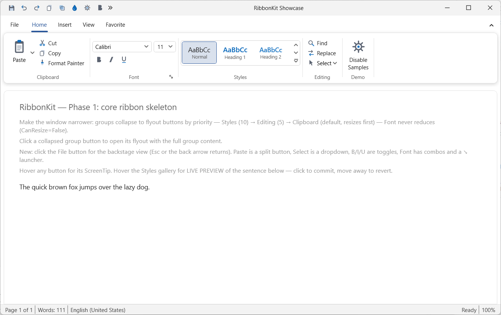
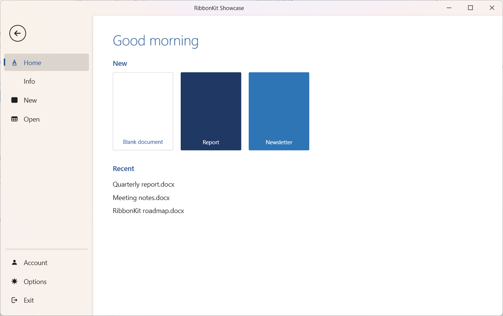
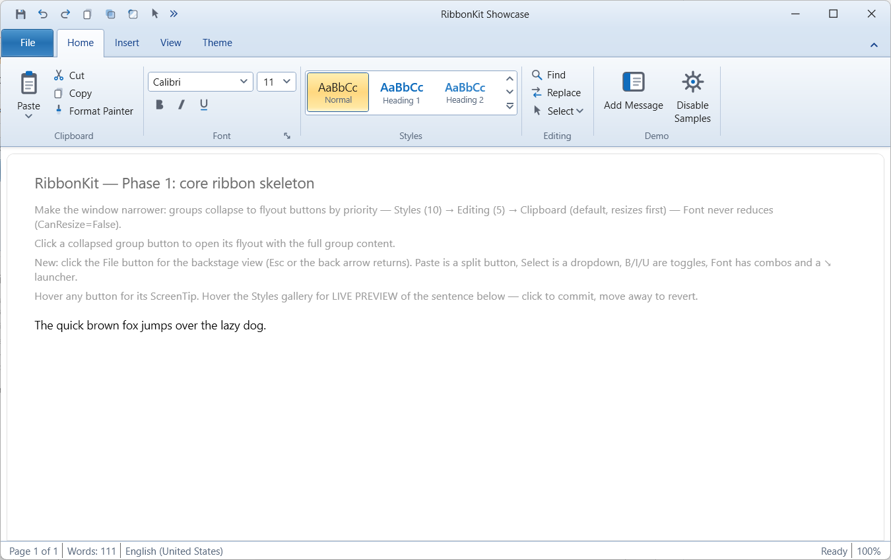
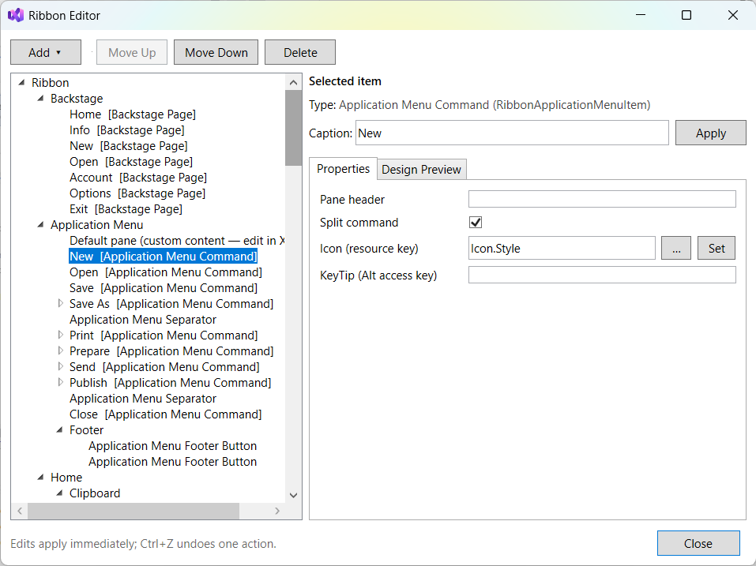

# RibbonKit

An MIT-licensed, Office Fluent UI-style **WPF ribbon library** for
`net8.0-windows` and `net9.0-windows`.

[](LICENSE)
[](https://github.com/Wraith1080/RibbonKit/releases/tag/v1.0.0)

[Getting started](#getting-started) · [Features](#feature-status) ·
[Theming](#theming--rendering) · [Design tools](#developer-experience) ·
[Documentation](#documentation) · [Roadmap](#post-v1-roadmap)



RibbonKit uses lookless controls, WPF commands/binding and one shared template set
for five Office generations. Vector chrome remains sharp when the host enables
per-monitor DPI awareness. Applications own their command icons and document model.

`v1.0.0` is distributed through GitHub Releases, not NuGet.org. The feature summary
below describes the current checkout, including post-release additions; see
[release notes](RELEASE_NOTES.md) for the published package and
[current progress](04-DESIGN-NOTES.md#5-current-state--next-steps) for dated acceptance limits.

## Feature status

### Structure & layout

- Ribbon, tabs, groups, dialog launchers and adaptive large → medium → small → collapsed sizing.
- Collapsed-group flyouts, minimized ribbon, double-click/chevron/Ctrl+F1 toggle.
- Tab/group horizontal scrolling and optional `RibbonWindow` title/QAT/contextual integration.
- Arbitrary WPF group content, with optional `IRibbonSizeAware` participation.
- Simplified single-row ribbon remains a candidate.

### Controls

- `RibbonButton`, toggle, split and dropdown commands in adaptive sizes; button stacks.
- `RibbonMenu`/`RibbonMenuItem`, editable/read-only `RibbonComboBox` and `RibbonTextBox`,
  `RibbonCheckBox`, `RibbonRadioButton` and `RibbonGroupSeparator`.
- `InRibbonGallery`, resizable gallery popups, grouping/filtering and live-preview events.
- ScreenTips with title/body/image/F1 help and chained KeyTips.
- `RibbonScrollBar` preserves native range behavior. Its button, thumb and rail corner
  properties also style native scrollbars created by a `ScrollViewer`.

### Application-level

- File tab or Office 2007 orb, two-pane application menu, and Backstage with Modern,
  Classic, Classic2010, Glass2007, Classic2007, CrystalSidebar and CrystalFloating designs.
- Repeatable message bars with actions/dismissal; Backstage page/footer/recent patterns.
- Three QAT placements, overflow and source-linked button/toggle/split/dropdown proxies.
- Contextual tabs, tab/group merging and modal-tab lifetimes.
- Ribbon/QAT customization with JSON Import/Export/Reset and application-controlled storage.



### Input & accessibility

Keyboard arrows/Tab/F6, Alt chains, UIA peers, localized built-in strings and RTL
surfaces have recorded verification. Showcase's Localization/RTL lab exercises
provider refresh, mirroring, popup edges and customization. Application-authored
labels remain the application's responsibility. A complete Windows contrast-theme
mode is **not supported**; gallery/scrollbar system-color fallbacks are narrower.

Ribbon actions use a solid theme-colored keyboard-focus outline. The ribbon container
is excluded from the tab order. Application-menu commands and dropdown rows have one
Tab stop; split rows expose their command and arrow separately. Enter or Space invokes
the focused action, and keyboard navigation updates the corresponding menu pane.
The Tab sequence follows ribbon headers and commands before a QAT placed below the
ribbon. Dropdown and split menus focus their items on opening, support cyclic Tab
and arrow navigation, and return focus to their opener on keyboard dismissal.
Application-menu arrows move between navigation rows, split targets and pane
commands, mirrored in RTL. Backstage cycles through navigation, page commands and
the return button; action entries such as Options and Exit accept focus without
changing the selected page.
Entering the ribbon from document content starts at File when present. QAT commands
that have moved into overflow are excluded from keyboard navigation until they
return to the strip. Opening Backstage focuses its active navigation item, falling
back to the first available item when needed. Its navigation and return actions
use one shared focus outline.
The outline follows animated surfaces during movement. Collapsed-group flyouts
focus their commands on opening, cycle through Tab and arrow navigation, and
return focus to their opener on keyboard dismissal.
Focus outlines follow the visible template border's position and corner shape,
including inset margins, RTL and render transforms. Circular Back buttons and
application orbs use rings that follow their visible discs.
Accent-filled Backstage rails and ribbon headers use a contrasting light or dark
outline when the usual accent outline would blend into the surface. The outline
refreshes when the palette or title-bar coloring changes while focus is retained.

### Theming & rendering

Office 2007, 2010, 2013, 2019 and 2024 each have light and dark/black palettes, with
live theme/accent switching. The Crystal Light theme choice now has both light and
dark palettes for the same shared `Controls.*.xaml` templates. Shared Crystal
resources cover menu rows, inputs, galleries, check/radio controls, ScreenTips
and the built-in Ribbon/QAT customization pages, QAT drawer, message bars and
the two-pane application menu in applications using `ThemeManager.Apply`.
The drawer retains its inset, rim,
shadow and body rounding through light/dark, minimized and message states.
Its shared `QatExtender.*`, `QatExtenderShadow`, `ContentCornerRadiusQatBelow`
and `ContentZIndexQatBelow` theme resources support scoped overrides;
explicit local part values retain WPF precedence. Message rows retain semantic
amber paint, independent dismissal and actions. The shared
`RibbonKit.Styles.MessageBar.ActionButton` style uses one action template and state
implementation shared with Crystal Backstage. `RibbonKit.Metrics.MessageBar.ActionCornerRadius`,
`ActionUseGlassMaterial` and `ActionDisabledOpacity` preserve Crystal's 12-DIP glass
action and Office's compact appearance. Explicit message styles and the scoped
`RibbonKit.Templates.MessageBar.ActionButton` template key remain available.
`RibbonKit.Metrics.ContentCornerRadiusTop` keeps Crystal's body rounded above
messages. Scoped resources and explicit action styles/values retain WPF precedence.
QAT icon/hover policy follows the ribbon's effective resource scope through
`RibbonKit.Metrics.QatTitleBarColored` and `QatTabRowColored`. ThemeManager sets
these alongside its accent bands; independent palettes retain their own defaults.
Crystal Sidebar/Floating Backstage geometry can be overridden through
`RibbonKit.Metrics.Backstage.*`, including `SidebarWidth`, `FloatingMargin` and
`ActionCornerRadius`. Those layouts contain no fixed application branding.
The application menu receives its translucent paint, 14-DIP outer corners,
rounded content/split rows, responsive pane width and outside-only shadow from
shared resources. `RibbonKit.Metrics.ApplicationMenuPaneWidth`,
`ApplicationMenuPaneMinimumWidth` and `ApplicationMenuPaneViewportInset` set its
preferred width, lower bound and viewport allowance; scoped resources and local
part values retain WPF precedence. The shared frame stays within the window's
available height, with scrolling navigation and pane content and a visible footer.
Office keeps its existing menu geometry when it fits.
Shared utility templates provide Crystal rims for minimize, modal close, QAT
overflow, ribbon/tab scroll arrows and merged-caption buttons. Native scrollbars
in Crystal scope use the shared 14-DIP template with 4-DIP corners and layered
6/8/11-percent thumb washes, including Options/customization pages. Scoped
scrollbar tokens and explicit styles/paint retain WPF precedence;
`RibbonKit.Brushes.ScrollBar.WashAccent` scopes the wash independently of text.
Customization list/tree frames share `RibbonKit.Metrics.Customize.FrameInset`:
2 DIPs in Crystal and 1 DIP in Office, with explicit control padding added to it.
The pages round inset edges individually to keep painted native-scrollbar gaps
equal at fractional DPI.
Ordinary `RibbonTab` controls in Crystal scope derive contextual glass headers,
rims, text and reflective markers from a solid `ContextualColor`; gradient/custom
brushes retain the ordinary renderer. Local foreground/marker values and scoped
paint overrides retain precedence. No Showcase contextual subclass is needed.

`ThemeManager.CreatePalette(theme, accent: null, dark: false)` creates an independent
palette for a window or control. Office uses its normal accent treatment; Crystal
tints the glass material while retaining highlight geometry, readable text and
semantic notice colors. Merge the returned dictionary into the owner's resources;
replace or remove it to change or clear that scope. Creation does not change the
global theme, accent preferences or other windows. For example:

```csharp
var palette = ThemeManager.CreatePalette(RibbonTheme.CrystalLight, Colors.Purple, dark: true);
window.Resources.MergedDictionaries.Add(palette);
```

`ThemeManager.SetAccent` retains its existing application accent behavior.
Showcase still owns document paint and document-under-QAT treatment. Optional
menu/popup capture is available through `CapturedBackdrop` in `RibbonKit.Controls`:

```csharp
var capture = new CapturedBackdrop(fileMenu, window);
capture.Apply(true);       // Also supports dropdown/split buttons and ribbon groups.
capture.Refresh();         // After the host changes document paint.
capture.Apply(false);      // Restores the ordinary shared surface.
capture.Dispose();         // When the registration/host is retired.
```

The host supplies a loaded WPF visual on the same dispatcher. For File menus it
must be an ancestor of the menu surface; popup capture can sample another visual
in the host window. Capture samples that visual, with a 6-DIP Gaussian blur and
24-DIP sampling margin. It excludes menu foreground, keeps captured pixels out of
measurement/input/focus, and follows scrolling, geometry, DPI, reopening and
template changes. Popup tint uses the scoped
`RibbonKit.Brushes.ApplicationMenu.FrameBand` token; explicit surface backgrounds
and bindings retain precedence. `Refresh` coalesces host paint/palette updates.
Unload releases paint and load reattaches while enabled; dispose removes all
registration handlers. Templates without the shared surface parts keep their
ordinary paint. Core Crystal needs neither capture nor a native window material.

The separate optional cross-theme glass treatment is a scoped resource overlay:

```csharp
var glass = ThemeManager.CreateGlassOverlay(window, dark: true);
window.Resources.MergedDictionaries.Add(glass);
// Remove glass before regenerating after theme/accent/palette changes.
window.Resources.MergedDictionaries.Remove(glass);
```

The factory clones the scope's effective brushes without changing global state.
Direct scoped and child resources keep normal WPF precedence. The host owns
replacement/removal and the decision to use glass after native Acrylic activation
succeeds; the factory itself does not activate Acrylic. WPF capture samples app
content rather than the desktop or native DWM material. Document content, update
timing, preferences, native backdrop activation and window integration stay in
the host.

Office 2007 defaults to the round application orb, including its black palette;
other themes default to a File tab. Set `Ribbon.ApplicationButtonShape` to `Tab`
or `Orb` to override the theme, and clear that local value to follow the theme again.
The application menu or Backstage surface remains the host's choice.
Set `Ribbon.ApplicationOrbGlyphTemplate` to a `DataTemplate` for a custom vector
mark in the orb's 16-DIP glyph canvas. `null` keeps the built-in four-square mark.
The sphere and Classic2007 Backstage Back button use the same chrome, while the
glyph template is instantiated separately in each button.

`RibbonWindow` supports compatible Mica/Acrylic backdrops and separate optional
frame appearance. Theme selection does not silently enable a material.
Contextual tabs can optionally set `RibbonTab.ContextualSelectionBrush` for a distinct
selection marker; null uses the contextual tint or Crystal's reflective treatment
of it. Showcase's **Samples** tab compares Crystal with Office 2024 and demonstrates
tab/body scrolling, QAT overflow, option states and optional document edge effects.
Use **View** for theme, tint, File layout and native backdrop selection.
Motion honors reduced-motion settings. Recorded DPI checks include 100/125/150/175/200%
and mixed-monitor scenarios; new changes still need their applicable checks.



### Developer experience

MVVM-friendly binding/templates, public API/XML-doc enforcement, deterministic visual
snapshots and the runnable Showcase support development. The separate Visual Studio
design-tools assembly provides context commands, responsive Ribbon Editor, structural
drag/drop and design-only theme/tab/File preview. Its delivery surface is context
menus, **not a floating smart-tag glyph**.



See [design-tools setup](src/RibbonKit.Design/SETUP-DESIGNTOOLS.md), including the
[Icons.xaml browser](src/RibbonKit.Design/SETUP-DESIGNTOOLS.md#using-the-iconsxaml-browser).

### Preview: MDI emulation

`MdiContainer`, `MdiDocument` and `MdiChild` provide themed floating child windows.
Setting `MdiContainer.Ribbon` merges the active document's tabs and, when maximized,
its caption controls. `IsCaptionMergeEnabled="False"` keeps tab merge without moving
caption controls. Leaving `Ribbon` unset maximizes inside the client area.

Arrange/cycle commands, full MVVM demonstration, tabbed mode and layout persistence
remain in the [MDI plan](docs/05-MDI-EMULATION-PLAN.md).

## Getting started

Download `RibbonKit.1.0.0.nupkg` from the
[v1.0.0 release](https://github.com/Wraith1080/RibbonKit/releases/tag/v1.0.0) into a local
package folder, then run in your WPF application project:

```powershell
dotnet add package RibbonKit --version 1.0.0 --source C:\path\to\downloaded-packages
```

For source development, reference `src/RibbonKit/RibbonKit.csproj` instead.
Use `urn:ribbonkit`; Office 2024 light is the default. A minimal window:

```xml
<rk:RibbonWindow x:Class="MyApp.MainWindow"
    xmlns="http://schemas.microsoft.com/winfx/2006/xaml/presentation"
    xmlns:x="http://schemas.microsoft.com/winfx/2006/xaml"
    xmlns:rk="urn:ribbonkit" Title="My App" UseLayoutRounding="True">
  <DockPanel>
    <rk:Ribbon DockPanel.Dock="Top" QuickAccessPosition="BelowRibbon">
      <rk:RibbonTab Header="Home">
        <rk:RibbonGroup Header="Clipboard">
          <rk:RibbonButton Header="Paste" Size="Large"
              Command="{Binding PasteCommand}" ScreenTipTitle="Paste (Ctrl+V)" />
          <rk:RibbonButton Header="Cut" Size="Small" />
          <rk:RibbonButton Header="Copy" Size="Small" />
        </rk:RibbonGroup>
      </rk:RibbonTab>
    </rk:Ribbon>
    <Grid><!-- application content --></Grid>
  </DockPanel>
</rk:RibbonWindow>
```

Make the code-behind base `RibbonKit.Controls.RibbonWindow`, match `x:Class`, and wire
your commands. Assign application-owned `ImageSource` resources to `Icon`/`LargeIcon`.
A normal WPF `Window` can host the ribbon when title-bar integration is unnecessary.
For File surfaces, galleries and richer command wiring, use the Showcase examples.

### DPI manifest

The host owns process DPI awareness. Copy the complete
[Showcase manifest](samples/RibbonKit.Showcase/app.manifest) and set
`<ApplicationManifest>app.manifest</ApplicationManifest>` in the app project.
It contains the DPI-awareness and Windows compatibility declarations; copying only
one XML fragment can omit required host configuration. Verify actual monitor changes.

### Theme and localization APIs

```csharp
// using RibbonKit.Theming;
ThemeManager.Apply(Application.Current, RibbonTheme.Office2010);
ThemeManager.SetAccent(Application.Current, Colors.SeaGreen);
ThemeManager.SetDarkMode(Application.Current, true);
// ClearAccent returns to the selected theme's default accent.
```

Assign `RibbonLocalization.Provider` to override built-in text; returning null from
`IRibbonLocalizationProvider.GetString` uses the embedded culture fallback.

## Building from source

Use Windows with the .NET SDKs required by the projects and, for designer work,
Visual Studio with the .NET desktop workload. The solution also builds the separate
`net472` design-tools project.

```powershell
dotnet build RibbonKit.sln
dotnet run --project samples/RibbonKit.Showcase/RibbonKit.Showcase.csproj
dotnet run --project samples/RibbonKit.Writer/RibbonKit.Writer.csproj
```

Choose the app you want to inspect. [CONTRIBUTING.md](CONTRIBUTING.md#proportional-validation)
owns focused/full validation and pack/consumer-check commands. Packages go to ignored
`artifacts/`; repository scripts do not publish them. Use
`eng/Measure-ShowcasePerformance.ps1` for outside-debugger Release measurements.

## Documentation

| Reference | Purpose |
| --- | --- |
| [Design notes §5](04-DESIGN-NOTES.md#5-current-state--next-steps) | Current progress, next task and remaining acceptance |
| [Design-history index](04-DESIGN-NOTES.md#3-implemented-features-chronological-with-pitfalls) | Numbered implementation evidence and pitfalls |
| [Architecture](docs/01-ARCHITECTURE.md) | Actual source layout and subsystem contracts |
| [Roadmap](docs/03-ROADMAP.md) | Completed phases and candidate tracks |
| [MDI](docs/05-MDI-EMULATION-PLAN.md) / [merge and modal](docs/06-MERGE-AND-MODAL-PLAN.md) | Service/lifetime contracts and remaining MDI work |
| [Office 2007](docs/07-OFFICE-2007-THEME-PLAN.md) | Retained visual measurements and frame/File boundaries |
| [Custom projections](docs/08-CUSTOM-CONTROL-INTEGRATION-PLAN.md) / [future themes](docs/09-FUTURE-THEMES-PLAN.md) | Provisional designs, not shipped APIs |
| [Writer product](docs/10-RIBBONKIT-WRITER-PLAN.md) / [packet map](docs/11-RIBBONKIT-WRITER-LUNA-EXECUTION-PLAN.md) | Consumer scope and remaining delivery gates |
| [Writer friction](docs/12-RIBBONKIT-WRITER-CONSUMER-FRICTION-LOG.md) | Open investigations, corrections and linked evidence |
| [Visual tests](tests/RibbonKit.VisualTests/README.md) | Deterministic rendering and approval procedure |

## Post-v1 roadmap

Writer includes native persistence, page settings, preview/printing, tables/pictures,
contextual editing and Settings. Paper opens as one centered sheet that grows downward
with the document; its dotted margin guide grows with it. Print Preview and printing
retain physical pagination. View > Continuous provides a workspace-filling editor.
Editable multipage editing was canceled due to bloat. Outstanding acceptance gates and
the distribution decision remain detailed in the current-status page.
Library work includes the remaining MDI milestones and separately scoped projection,
accessibility and theme candidates. Plans do not establish implementation or acceptance.

## Contributing

See [CONTRIBUTING.md](CONTRIBUTING.md). Keep changes focused and verify the affected
behavior. Public APIs follow the shipped/unshipped compatibility baseline.

## Development provenance

RibbonKit was developed primarily with AI assistants under human direction, visual
review and automated verification. Attribution is **RibbonKit contributors**.

## License

[MIT](LICENSE)
